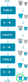

# Das 4-Liter-Rätsel

Schau dir den folgenden kurzen Ausschnitt aus dem Film "Stirb Langsam 3" an. In dieser Szene müssen 
die beiden Hauptfiguren ein Rätsel lösen, um eine Bombe zu entschärfen:

::video[./resources/Stirb-langsam-4-Gallonen.mp4]

[Stirb Langsam 3 - Auschnitt](resources/Stirb-langsam-4-Gallonen.mp4), 20th Century Fox 

:::note['Gallonen']
Im Film wird von **"Gallonen"** gesprochen. Dies ist ein amerikanisches Volumenmass,
es entspricht ungefähr 3.8 Litern. Wir verwenden hier stattdessen Liter.
:::

Anhand des 4-Liter-Rätsels werden wir untersuchen, was einen Algorithmus genau ausmacht.

## Wichtiges und unwichtiges

Nicht alle Informationen, die im Film gezeigt werden, sind für die Lösung des Rätsels wichtig.
Beispiele für Dinge, die nicht wichtig sind:

   * Farbe und Form der Eimer
   * Der Ort, wo die Eimer und die Bombe stehen
   * Ob die Eimer mit Wasser oder mit Coca-Cola gefüllt werden
   * Dass sich die Hauptdarsteller bei der Lösung des Rätsel streiten
   * Ob wir die Wassermenge in Litern oder Gallonen messen (solange 
     die Waage in der Bombe mit der gleichen Einheit misst!)

Hingegen gibt es wichtige Informationen:

    * Die Eimer haben ein Fassungsvermögen von 3 und 5 Litern
    * Die Bombe muss mit exakt 4 Litern Wasser entschärft werden
    * Die Eimer können beliebig oft gefüllt und geleert werden
    * Es gibt keine Möglichkeit, die Eimer zu markieren, um zu wissen,
      wie viel Wasser sich darin befindet
    
## Grundoperationen

Um das Rätsel zu lösen, haben wir nur eine eine begrenzte Auswahl von
Dingen zur Verfügung, die wir tun können (wegrennen können wir 
beispielsweise nicht und auch nicht nur ungefähr schätzen, wieviel 
Wasser wir in einen Eimer füllen). 

Wir nennen die Dinge, die wir tun können, **Grundoperationen**. 
Eine ist unten bereits gegeben. 

   1. Wir können den 5-Liter-Eimer vollständig füllen.

Es gibt noch 5 weitere Grundoperationen, die wir ausführen können. Kannst du
sie alle finden?

:::aufgabe[Aufgabe 1: Grundoperationen]

Schreibe alle 6 Grundoperationen auf.

<Answer type="text" id="f5f53f3a-aa7a-44ac-8c7b-db7f5c789f05" />

<Solution id="848be934-c19d-4d3d-95fc-ed0e1faf23c5">
   1. Wir können den 5-Liter-Eimer vollständig füllen.
   2. Wir können den 3-Liter-Eimer vollständig füllen.
   3. Wir können den 5-Liter-Eimer vollständig leeren.
   4. Wir können den 3-Liter-Eimer vollständig leeren.
   5. Wir können den 5-Liter-Eimer in den 3-Liter-Eimer schütten (bis der 3-Liter-Eimer voll ist).
   6. Wir können den 3-Liter-Eimer in den 5-Liter-Eimer schütten (bis der 5-Liter-Eimer voll ist).
</Solution>
:::

## Lösungssuche

Dein Ziel ist es, den 5-Liter-Eimer mit genau 4 Litern zu füllen. Dazu musst du eine
Schritt-für-Schritt-Anleitung notieren, bei denen jeder Schritt nur aus genau einer
der 6 möglichen Grundoperationen besteht.

Deine Anleitung könnte ungefähr so anfangen (G steht für '**G**rosser Eimer', 
K für '**K**leiner Eimer'):

Es gibt zwei sinnvolle Lösungen. "Sinnvoll" sind Lösungen, wenn sie keine unnötigen 
Schritte enthalten.

:::aufgabe[Aufgabe 2: Lösung 1 - 6 Schritte nötig]
<Answer type="state" id="7f4f79fd-7b4b-4faa-8aa3-5b3185fd2f3b" />

Finde eine der beiden möglichen Lösungen und zeichne sie wie oben dargestellt.
Die Kübel musst du nicht zeichnen, aber die Kästen und Pfeile schon!

Du darfst jede Grundoperation so oft verwenden, wie du willst.

Lösung 1 besteht aus 6 Schritten. Wenn die Lösung, die du gefunden hast, aus 8
Schritten besteht, schaue bei der nächsten Aufgabe nach!

<Solution id="79559f8b-aa4b-4f73-ac72-2a960a5bd380">

</Solution>
:::

:::aufgabe[Aufgabe 3: Lösung 2 - 8 Schritte nötig]
<Answer type="state" id="f9fe76fa-496a-4b3b-aa45-7b0762527693" />

Wenn du die erste Lösung gefunden hast, versuche, auch noch die 
zweite Lösung zu finden.

Lösung 2 besteht aus 8 Schritten. Wenn die Lösung, die du gefunden hast, 
nur 6 Schritte hat, schaue bei der vorherigen Aufgabe nach!

<Solution id="0913c461-493f-4da7-9c27-85a5c7c78287">

</Solution>
:::

## Bewertung der Lösung

Wenn du beide Lösungen gefunden hast, musst du dich für eine entscheiden.

:::aufgabe[Aufgabe 4: Bewertung der Lösung]
<Answer type="state" id="5ea73a39-90d9-46e0-ab4f-c93a0818a4c5" />

Welche der Lösungen würdest du verwenden, um die Bombe zu entschärfen, und weshalb?

<Solution id="77978ea5-25ea-4d12-8201-95a17bbc29ed">
Lösung 1. Sie hat 2 Schritte weniger, weshalb sie wahrscheinlich die schnellere ist.
Das spielt eine Rolle, weil wir unter Zeitdruck stehen.

Du solltest mitnehmen: Oft gibt es für Probleme mehrere Lösungen, aber nicht alle
sind gleich effizient. Wenn wir daran interessiert sind, möglichst schnelle 
Algorithmen zu finden, dann optimieren wir auf **Zeiteffizienz**.

Es gibt auch andere Gütekriterien für Algorithmen, z.B. ihre **Platzeffizienz** (d.h.
wieviel Speicherplatz sie benötigen, um die Lösung zu finden). 
</Solution>
:::

