import Excalidoc from '@tdev/excalidoc/Component';

# Kombination von Bausteinen

Algorithmen bestehen selten nur aus einer einzigen Sequenz, einer einzigen
Schleife oder einer einzigen Entscheidung. Stattdessen sind sie oft
aus vielen Dutzenden, hunderten oder sogar tausenden solcher Bausteine
zusammengesetzt.

Durch die Kombination der im vorherigen Kapitel vorgestellten 7 Bausteine
(Sequenz, 3 Entscheidungsmuster, 3 Schleifenmuster) können nämlich beliebig
komplizierte Algorithmen gebaut werden.

In diesem Lernschritt wirst du dich damit vertraut machen, wie kompliziertere
Algorithmen aus einfachen Grundbausteinen entstehen können und wie du in einem
Algorithmus die Grundbausteine (Sequenzen, Entscheidungen, Schleifen) erkennen
kannst.

## Bausteine ineinander einsetzen

Ein Beispiel: Wir setzen eine `Sequenz` in einen `if`-Baustein ein:

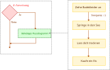

Das Resultat sieht so aus:

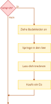

:::aufgabe[Aufgabe 1: Bausteine ineinander einsetzen]
<Answer type="state" id="4197e8e3-5140-414d-a2fe-48c345155426" />

Gegeben sind die folgenden Bausteine und einzelnen Anweisungsblöcke.

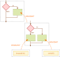

   1. Um welche Bausteine handelt es sich? Benenne sie.
   2. Setze die Elemente wie mit den orangen Pfeilen angedeutet ineinander ein und 
      zeichne das daraus resultierende Flussdiagramm.

Hier kannst du deine Lösung skizzieren, wenn du willst - oder sie auf ein Blatt Papier
zeichnen:

<Excalidoc id="7687384b-f39a-41b1-97ff-a97fd38a27f9"
        defaultImage={require('./resources/example-flowchart-1.excalidraw').default} />

<Solution id="6fe3f593-2da5-44d0-b099-4f90a1863b2c">

   1. Es gibt einen `if`-Baustein und einen `if-else`-Baustein.
   2. Das Resultat der Einsetzungen sieht folgendermassen aus (Der graue Rahmen dient nur zum Verständnis, wo der `if-else`-Baustein in den `if`-Baustein
eingesetzt wurde. Er gehört nicht zum fertigen Flussdiagramm):
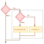

</Solution>
:::

:::aufgabe[Aufgabe 2: Bausteine ineinander einsetzen]
<Answer type="state" id="9135a28a-cdb4-42f9-9fe8-23ad09afd052" />

Gegeben sind die folgenden Bausteine und einzelnen Anweisungsblöcke:

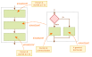

   1. Um welche Bausteine handelt es sich? Benenne sie.
   2. Setze die Elemente wie mit den orangen Pfeilen angedeutet ineinander ein und zeichne das daraus resultierende Flussdiagramm

Hier kannst du deine Lösung skizzieren, wenn du willst - oder sie auf ein Blatt Papier
zeichnen:

<Excalidoc id="5213bd98-fda5-400a-b875-973b01aeb2bd"
        defaultImage={require('./resources/example-flowchart-1.excalidraw').default} />

<Solution id="f92100ec-44b7-466b-8fc6-f98c17432489">

   1. Es gibt eine `Sequenz` und einen `if-else`-Baustein.
   2. Das Resultat der Einsetzungen sieht folgendermassen aus (Der graue Rahmen dient nur zum Verständnis, wo der `if-else`-Baustein 
   in die `Sequenz` eingesetzt wurde. Er gehört nicht zum fertigen Flussdiagramm):

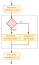

</Solution>
:::

## Dekomposition - Bausteine identifizieren

Wenn wir immer nur die vorgegebenen 7 Bausteine ineinander einsetzen, werden wir immer einen
*strukturierten* Algorithmus erhalten, der auch wieder in die Grundbausteine zerlegt werden 
kann.

Sobald du etwas Erfahrung damit hast, wirst du dies völlig ohne Nachdenken schaffen können - 
am Anfang ist es allerdings nicht leicht zu sehen, aus welchen Bausteinen ein Algorithmus 
zusammengesetzt ist. 

Wir wollen einen Algorithmus in seine Bestandteile zerlegen, damit wir auch über
kleinere Teile nachdenken können, ohne ständig den ganzen Algorithmus im Kopf behalten zu
müssen. Das geht nämlich bei komplizierten Algorithmen gar nicht, unser Gehirn würde
explodieren! 

Deshalb schauen wir uns auch an, wie man die Zerlegung angehen kann.

:::aufgabe[Aufgabe 3: Bausteine identifizieren]
<Answer type="state" id="91aeac01-fb43-45da-a615-f6945e5eb1e5" />

Gegeben ist das folgende strukturierte Flussdiagramm:

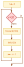

   Finde alle Bausteine, die verwendet wurden, um dieses Flussdiagramm zu erzeugen, und 
   zeichne um jeden Baustein, den du findest, einen Rahmen drum herum. Schreibe dazu, um
   welchen Baustein es sich jeweils handelt.

<Solution id="c91499ec-f509-411e-8406-bca586e73f3a">

Hier siehst du Schritt für Schritt, wie die Lösung erarbeitet wird:
   
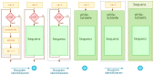

Wir sind dann fertig, wenn das ganze Flussdiagramm in eine Gruppe verschachtelter Bausteine
verwandelt wurde. Dies ist oben in Bild 3 der Fall. 

**Beachte**: Von Bild 2 zu Bild 3: Wir sehen, dass wir es mit zwei Elementen zu tun haben, 
die aufeinander folgen - die `r <-- 0`-Anweisung, gefolgt von dem while-Baustein. Zwei 
Elemente, die aufeinander folgen, sind eine Sequenz.

**Beachte**: Baustein-Blöcke überschneiden sich nie. Sie sind immer vollständig in einem
anderen Baustein enthalten.

</Solution>
:::

:::aufgabe[Aufgabe 4: Bausteine identifizieren]
<Answer type="state" id="4451545a-02c0-4970-b487-22870b5fda70" />

Gegeben ist das folgende strukturierte Flussdiagramm:

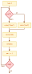

   Finde alle Bausteine, die verwendet wurden, um dieses Flussdiagramm zu erzeugen, und 
   zeichne um jeden Baustein, den du findest, einen Rahmen drum herum. Schreibe dazu, um
   welchen Baustein es sich jeweils handelt.

<Solution id="b828dd08-6831-4238-922d-801f46418e5c">

Hier siehst du Schritt für Schritt, wie die Lösung erarbeitet wird:
   
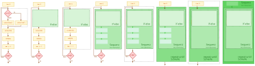

**Beachte**: Du hättest im ersten Schritt auch die Sequenz nach dem `if-else`-Baustein
(mit 3 Elementen) identifizieren können. Dann hättest du aber, nachdem du den `if-else`-
Baustein gefunden hättest, gemerkt, dass du es mit einer grösseren Sequenz mit 4 statt nur
3 Elementen zu tun hast:

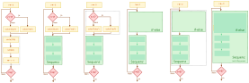

Wenn du ein einzelnes Element hast, das auf eine Sequenz folgt oder auf das eine Sequenz
folgt, kannst du das Element immer einfach zur Sequenz hinzufügen. 

Dasselbe gilt auch für zwei Sequenzen, die direkt aufeinander folgen: In dem Fall kannst du sie
einfach zu einer einzigen, grossen Sequenz zusammenfassen.
</Solution>
:::

---

# :mdi[Cloud-Download] Printmaterial

:mdi[File-PdfBox]{.red size=1.5em} [M1 Arbeitsblatt Strukturierte Flussdiagramme.pdf](resources/M1-AB-StrukturierteFlussdiagramme.pdf)

{ /* 
 */ }

