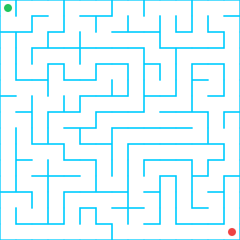

# Nicht-triviale Algorithmen

Hier ist ein Labyrinth:

Wie kommst du vom Start (links oben, grün markiert) Ziel (links unten, rot markiert)?

## Eine konkrete Lösung

Du kannst dieses Problem in ein oder zwei Minuten lösen. Wenn wir passende Grundoperationen definieren,
kannst du die Lösung auch als Algorithmus formulieren oder als Flussdiagramm aufzeichnen, z.B. so:

### Grundoperationen

   1. Bewege dich vorwärts
   2. Drehe dich 90 Grad im Uhrzeigersinn
   3. Drehe dich 90 Grad im Gegenuhrzeigersinn
   4. Drehe dich nach Norden

(Die 4. Operation ist nur nötig, um uns in eine klar definierte Startposition zu bringen. Die dritte ist 
ebenfalls nicht zwingend nötig)

### Mögliche Lösung

Die Lösung beginnt nun so: 3 - 2 - 2 - 1 - 3 - 1 - 3 - 1 - ... 

Nun ist das Labyrinth von oben aber nicht das einzige, und der Algorithmus zur Lösung des Labyrinths
von oben ist nicht hilfreich, sobald du es mit einem anderen Labyrinth zu tun hast:

:::flex

::br

::br

:::

Ein Algorithmus, der nur für ein einziges Labyrinth den Weg zum Ziel findet, ist deshalb nicht 
sehr hilfreich. Tatsächlich nützlich wäre ein Algorithmus, der für *jedes* Labyrinth den Weg
zum Ziel finden kann.

Dazu reichen aber Sequenzen nicht aus und dies ist der Grund, weshalb Algorithmen auch über 
Schleifen- und Entscheidungsbausteine verfügen müssen - ohne diese können wir kein Algorithmen
bauen, die nicht nur ein einziges, sondern eine ganze Klasse von Problemen (*alle* denkbaren 
Labyrinthe statt nur ein einziges konkretes) lösen.
