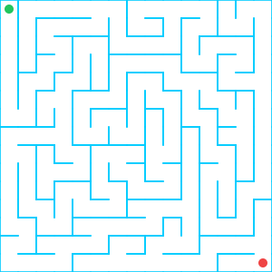
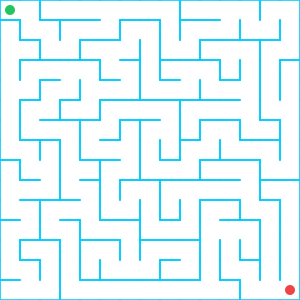
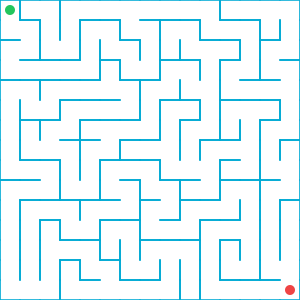

# Nicht-triviale Algorithmen

In diesem Kapitel untersuchen wir, weshalb Algorithmen Entscheidungs- und Schleifenbausteine
benötigen und wie uns diese Bausteine helfen können, nicht-triviale Probleme zu lösen. 

Wir illustrieren dies am Beispiel eines Algorithmus zur Lösung eines Labyrinths.

Wenn du Harry Potter 4 gelesen oder gesehen hast, weisst du, dass es hilfreich ist, wenn man
den Weg durch ein Labyrinth finden kann. Hier ist ein Labyrinth. Du bist der grüne Punkt oben
links. Unten rechts ist dein Ziel, der Feuerkelch.

## Eine spezifische Lösung

Du kannst dieses Problem in ungefähr einer Minute im Kopf lösen. Mit den passenden
Grundoperationen kannst du die Lösung auch eindeutig als Algorithmus formulieren und
ein entsprechendes Flussdiagramm dazu zeichnen.

### Grundoperationen

Wir definieren 4 Grundoperationen für Algorithmen, die Labyrinthe wie das obige
lösen sollen:

   1. Bewege dich ein Feld vorwärts
   2. Drehe dich 90 Grad im Uhrzeigersinn
   3. Drehe dich 90 Grad im Gegenuhrzeigersinn
   4. Drehe dich nach Norden

(Die 4. Operation ist nur nötig, um uns in eine klar definierte Startsituation zu bringen. 
Die dritte ist ebenfalls nicht zwingend nötig.)

### Mögliche Lösung

:::aufgabe[Aufgabe 1: Eine Lösung skizzieren]
<Answer type="state" id="1512a490-4e1b-4693-9f51-e66d2473343d" />

Schreib dir die ersten paar Operationen einer Lösung als Flussdiagramm-Sequenz auf.
Beginne mit Operation 4 (Ausrichtung nach Norden bzw gegen oben).

<Solution id="3a1d2556-5680-485b-8d92-c3338fd032b6">

Hier ist der Beginn der Lösung. Es ist jeweils nur die Nummer der Grundoperation
festgehalten statt die ganze Beschreibung.

Die komplette Lösung wäre sehr lang, aber problemlos beschreibbar. Wir machen das hier 
nicht, weil die Lösung an sich nicht wichtig ist, es geht nur darum, dass sie aus einer
einzigen Sequenz besteht, also nur um ihre *Form*. 
</Solution>
:::

## Alle Labyrinthe lösen?

Nun ist das Labyrinth von oben aber nicht das einzige, und der Algorithmus zur Lösung des 
Labyrinths ist nicht hilfreich, sobald du es mit einem anderen Labyrinth zu tun hast:

:::flex

::br

::br

:::

Ein Algorithmus, der nur für ein einziges, bereits bekanntes Labyrinth den Weg zum Ausgang 
findet, interessiert uns nicht.

Schwierig ist ja, den Ausgang zu finden, wenn man _im_ Labyrinth drin steckt und den Plan
des Labyrinths _nicht_ kennt. Für _dieses_ Problem wollen wir einen Lösungsalgorithmus haben.

Das ist ist deutlich schwieriger, als den Weg durch ein einziges spezifisches Labyrinth zu 
beschreiben, den du bereits kennst.

Ein solcher Algorithmus muss etwas über seine unmittelbare *Umgebung* im Labyrinth erfahren 
und basierend darauf unterschiedlich reagieren können.

Sequenzen reichen dafür nicht aus. Dazu benötigen wir zusätzlich auch die Entscheidungs- und 
Schleifenbausteine.

