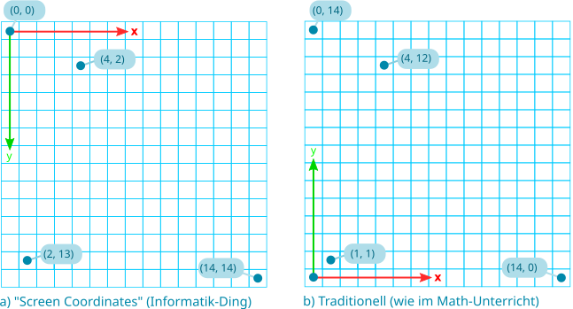
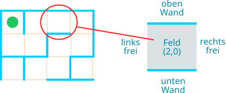
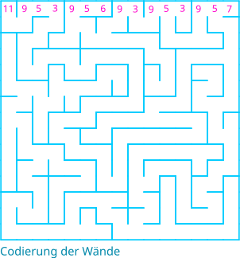

# Labyrinth-Zustand

*(konsultiere das Kapitel [Der Zustand eines Problems](../03%20Problemzustand),
wenn du nachschlagen willst, was wir mit dem _Zustand_ des Problems meinen).*

Woraus besteht der Zustand des Labyrinth-Problems? Anders gefragt: Was ist essentiell zur Lösung
des Problems?

**Nicht relevant:**
   - Ob am Ziel ein trimagischer Pokal, ein Goldschatz oder der Ausgang ist
   - Ob die Wände aus Stein oder aus Hecken gemacht sind
   - Wie hoch die Wände sind
   - Ob wir Harry Potter sind oder nicht 
   - ...

**Relevant:**
   - Unsere Position im Labyrinth
   - Unsere Orientierung im Labyrinth (ob wir nach Norden, Westen, Süden oder Osten schauen)
   - Die Position des Ziels im Labyrinth
   - Die Position der Wände im Labyrinth

Die beiden letzten Punkte sind etwas speziell, weil sich *ihr* Zustand über
die gesamte Laufzeit des Algorithmus vom Anfang bis zum Ende nicht ändern
wird. Das Ziel wandert nicht, und die Wände des Labyrinths bleiben auch stabil -
jedenfalls solange wir nicht durch ein Labyrinth in Hogwarts irren!

 :::note[Orientierung]
 Wir müssen unsere Orientierung festhalten, weil es Grundoperationen wie
"bewege dich ein Feld vorwärts" oder "drehe dich 90 Grad im Uhrzeigersinn" 
gibt. Das bedingt, dass wir wissen, welche Richtung mit "vorwärts" gemeint
ist und in welche Richtung wir schauen werden, nachdem wir uns 90 Grad 
gedreht haben.
:::

:::aufgabe[Aufgabe 1: Position von "Spieler" und Ziel]
<Answer type="state" id="f174ca4a-1d5d-4187-a684-ed53cbb4d65f" />

Überlege dir: 
   1. Wie kannst du die Position des Spielers im Labyrinth festhalten?
   2. Wie kannst du die Position des Ziels im Labyrinth festhalten?

<Solution id="3206ecc7-dba1-447a-8e7d-b47df3c7a00e">

Du siehst, dass das Labyrinth aus einzelnen Feldern besteht. Am einfachsten
definieren wir deshalb ein Koordinatensystem für das Labyrinth:

Wir können dem Feld links oben die Koordinaten (0, 0) geben. Du siehst in
der Illustration die Koordinaten einiger weiterer Punkte. Dieses Koordinatensystem
wird in der Informatik häufig verwendet, um Koordinaten auf einem Bildschirm
zu definieren, deshalb nennen wir diese Variante das Bildschirm-Koordinatensystem.

Sowohl unsere Position wie auch die Position des Ziels können wir dann einfach als
ein Koordinaten-Paar angeben.

Selbstverständlich könnten wir das Koordinatensystem auch so legen, wie du es aus
dem Mathematikunterricht gewohnt bist. Dann hätte der Punkt, der im Bildschirm-Koordinatensystem
die Koordinaten (0, 0) hat, stattdessen die Koordinaten (0, 14). Welches Koordinatensystem
wir verwenden, spielt eigentlich keine Rolle, es gibt hier kein "richtig" oder "falsch."

Wir entscheiden uns aber im Rest des Unterrichts jeweils für das Bildschirm-Koordinatensystem,
weil du es im Informatik-Kontext viel häufiger antriffst als das traditionelle aus dem
Mathematikunterricht.
</Solution>
:::

## Die Position der Wände des Labyrinths beschreiben

Die Beschreibung der Wände des Labyrinths ist ein wenig komplizierter.

:::flex
Wieder lohnt es sich, das Labyrinth als eine Sammlung einzelner Felder zu sehen,
welche in einem Raster angeordnet sind. Jedes Feld hat 4 Seiten, die jeweils 
entweder aus einer Wand oder einem Durchgang bestehen können.
::br

:::

:::aufgabe[Aufgabe 2: Wandkonfigurationen finden]
<Answer type="state" id="956a4eea-18f3-4ae2-88b3-29809ca69558" />

Wieviele verschiedene Kombinationen von Wänden und freien Wegen gibt es? 
Finde und skizziere sie alle. Hier sind zwei Kombinationen zur Starthilfe:

:mdi[Lightbulb]{.yellow size=1.5em} *Tipp: Gehe systematisch vor: Finde alle Möglichkeiten mit 3 Wänden, dann alle mit 2 Wänden usw.*

<Solution id="614346ea-f803-44c0-a206-dbaecb63c69a">

Es gibt 16 Möglichkeiten, aber zwei kommen in unserem Labyrinth nie vor:

Ein Feld, das 4 Wände hätte, gibt es in unserem Typ von Labyrinth nicht - es wäre
eine Insel, um die wir, wenn wir Pech haben, ewig im Kreis herumgehen könnten, deshalb ist sie
nicht aufgeführt. Felder ohne Wände kommen in den Labyrinthen, die wir lösen wollen, ebenfalls
nicht vor.
</Solution>
:::

Nun können wir das Labyrinth selbst als eine Folge von Zahlen beschreiben. Wir sagen in der
Fachsprache dazu, dass wir das Labyrinth als Folge von Zahlen **codieren**. Rechts siehst du
die Codierung der 15 Felder der ersten Zeile des Labyrinths:

:::flex

::br

:::

:::aufgabe[Aufgabe 3: Zweite Zeile]
<Answer type="state" id="2db910be-9656-4f2b-8b3c-1279c1d9cf84" />

   1. Wieviele Zahlen wird die fertige Codierung des gesamten Labyrinths umfassen?

   2. Codiere die 15 Felder der zweiten Zeile des Labyrinths.

<Solution id="97fbfe02-f51d-4e25-af58-4befdd7596c1">

Hier sind die Nummern der Wandkombinationen für die 15 Felder auf der zweiten Zeile
des Labyrinths:

12, 6, 9, 6, 8, 3, 9, 6, 12, 6, 10, 14, 10, 12, 3

</Solution>
:::

Nun haben wir eine gute Beschreibung des Labyrinths und wir können uns darum kümmern, 
wie wir diese Beschreibung verwenden können, um uns um die "halte stets Kontakt zur rechten 
Wand"-Vorgabe des Lösungsalgorithmus zu kümmern.

