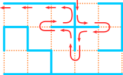
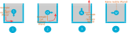
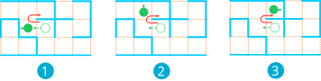
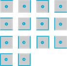

# Der Wand folgen

Wie können wir nun die Regel einhalten, dass wir unserer *rechten Wand* durch das Labyrinth
folgen sollen?

Das ist erst einmal zu schwierig. Wir sollten uns zuerst nur auf ein kleines, relativ 
einfaches Teilproblem konzentrieren.

Du siehst, dass in der Illustration oben der Weg über verschiedene Felder führt. Wir
können damit beginnen, uns nur für einen einzigen Typ von Feld zu überlegen, wie wir
uns auf so einem Feld verhalten müssen, damit der korrekte "folge-der-rechten-Wand"-Pfad 
entsteht.

## Was tun wir auf einem Feld #14?

Nehmen wir an, wir stehen beispielsweise auf einem Feld vom Typ #14:

Es gibt 4 Möglichkeiten, in welche Richtung wir orientiert sein können. Je nachdem, wie wir
orientiert sind, liegt *unsere* rechte Wand in einer anderen Richtung und wir müssen uns 
unterschiedlich verhalten, um der Wand zu folgen. 

### 4 Fallunterscheidungen

Zum Glück sind die Möglichkeiten begrenzt: Wir können entweder nach oben (Norden) blicken oder nach links, rechts oder unten. Diese 4 
Fälle schauen wir uns genau an:

    1. Falls wir nach unten (Süden) schauen, ist die *linke* Wand des Feldes unsere *rechte* Wand. Um 
    unserer rechten Wand zu folgen, müssen wir uns also einmal gegen den Uhrzeigersinn um 90 Grad
    drehen, so dass wir neu nach rechts schauen und die untere Wand des Feldes zu unserer rechten Wand 
    wird. 

    2. Falls wir nach rechts (Osten) schauen, ist die *untere* Wand des Feldes unsere *rechte* Wand. um ihr
    zu folgen, müssen wir uns gegen den Uhrzeigersinn um 90 Grad drehen, so dass wir nun nach oben
    (Norden) schauen und die *rechte* Wand des Feldes zu unserer *rechten* Wand wird.

    3. Falls wir nach oben schauen, ist die *rechte* Wand des Feldes auch *unsere* rechte Wand und
    wir können ihr folgen, indem wir einen Schritt vorwärts (nach Norden) machen.

    4. Falls wir nach links (Westen) schauen, gibt es rechts keine Wand. Wir können aber nicht 
    aus dem Osten gekommen sein, weil dort eine Wand ist. Wir befinden uns also erst ganz am
    Anfang des Algorithmus und müssen als erstes eine rechte Wand finden. Da wir sehen können, 
    dass wir der Wand so oder so nach Norden folgen werden (es ist der einzige Ausgang aus einer
    Sackgasse), drehen wir uns im Uhrzeigersinn um 90 Grad (nach Norden) und machen einen Schritt
    vorwärts.

:mdi[Lightbulb]{.yellow size=1.5em} Fälle 1 bis 3 zeigen uns, dass die rechte-Wand-Regel uns
tatsächlich hilft, aus einer Sackgasse herauszufinden. Wenn wir anfangs nach Süden schauen
(Fall 1), drehen wir uns nach Osten, sehen uns mit Fall 2 konfrontiert, drehen uns weiter 
nach Norden, haben nun den Fall 3 und machen deshalb einen Schritt nach Norden aus der 
Sackgasse heraus.

### Abkürzung oder nicht?

:mdi[Lightbulb]{.yellow size=1.5em} Ist es dir aufgefallen? Es gibt eine Abkürzung auf Feldern
vom Typ #14, die in allen 4 Fällen funktioniert: Wir könnten uns immer nach Norden orientieren 
und einen Schritt vorwärts machen, um die Sackgasse Richtung Norden zu verlassen.

Wir müssen uns entscheiden, ob wir auf einem Typ #14-Feld das Abkürzungsverhalten anwenden
wollen (immer auf das Nachbarfeld im Norden vorrücken) oder uns gemäss der Fälle 1 -4 verhalten.
Das würde heissen, dass wir uns manchmal nur drehen (z.B. in Fällen 1 und 2), aber nicht bewegen.

Wir legen uns hier fest: Unser Algorithmus soll uns _immer_ auf eines unserer Nachbarfelder 
bewegen. Er soll uns nie auf demselben Feld belassen und nur unsere Blickrichtung ändern.

Das entspricht dem "Abkürzung"-Verhalten, das oben für Typ #14-Felder erklärt worden ist.

## Das ganze Problem lösen

Was hilft es uns, wenn wir wissen, wie wir uns auf einem Feld #14 verhalten müssen?

Nun, die Regeln für Felder vom Typ #7, Typ #11 und Typ #13 sehen sehr ähnlich aus, da 
alle diese Felder ebenfalls 3 Wände haben und damit auch Sackgassen sind, aus der wir nur 
in eine Richtung entkommen können. Eigentlich sind es nur gedrehte Varianten von Typ #14,
wir können also die Verhaltensregeln für diese Feldtypen finden, indem wir die Regeln 
einfach entsprechend zurecht "drehen".

Wir wissen deshalb bereits, wie wir uns in 4 von 14 möglichen Fällen verhalten müssen. Wenn wir
nun auch noch die übrigen Typen von Feldern anschauen und Verhaltensregeln für sie finden, 
haben wir das Problem gelöst und wissen, wie wir uns an einem beliebigen Ort des Labyrinths 
verhalten müssen, um "der rechten Wand zu folgen".

Schauen wir uns Feldtypen mit 2 Wänden oder nur einer Wand an:

:::aufgabe[Aufgabe 1: Regeln für Typ #10]
<Answer type="state" id="c1ade4ff-bf17-4fda-9806-ee0fa2f66092" />

Bestimme die Regeln, die unser Verhalten auf Feldern des Typs #10 steuern.

<Solution id="41e159b3-330c-4b9d-bf72-aae007643dbb">

**Feld #10:**

   1. Wenn wir nach Norden oder Süden orientiert sind, gehen wir einfach einen Schritt 
   vorwärts, um unserer jeweils rechten Wand zu folgen.

   2. Wenn wir nach Westen oder Osten (rechts oder links) orientiert sind, gibt es keine
   rechte Wand und wir können auch nicht aus dem Osten oder Westen gekommen sein, weil dort
   ja Wände sind. Wir befinden uns also erst ganz am Anfang des Algorithmus und müssen als 
   erstes eine rechte Wand finden. Wir drehen uns also z.B. einmal um 90 Grad gegen den 
   Uhrzeigersinn und machen einen Schritt vorwärts. 
</Solution>
:::

:::aufgabe[Aufgabe 2: Regeln für Typ #12]
<Answer type="state" id="51498db6-8fcd-44a7-8e22-ed6530dea4f4" />

Bestimme die Regeln, die unser Verhalten auf Feldern des Typs #12 steuern.

<Solution id="a3c4126d-cc01-4641-8ca5-db2ed3c6bd60">
**Feld #12:**
   1. Wenn wir nach Süden orientiert sind, können wir sehen, dass wir unserer rechten Wand
   folgen können, indem wir uns 90 Grad gegen den Uhrzeigersinn drehen und einen Schritt
   vorwärts machen.

   2. Wenn wir nach Osten orientiert sind, machen wir einen Schritt vorwärts, um unserer
   rechten Wand zu folgen.

   3. Wenn wir nach Norden orientiert sind, können wir nicht aus dem Süden gekommen sein, 
   weil dort eine Wand ist. Wir befinden uns also ganz am Anfang des Algorithmus und müssen
   als erstes eine rechte Wand finden. Also drehen wir uns 90 Grad im Uhrzeigersinn und
   machen einen Schritt vorwärts.

   4. Wenn wir nach Westen orientiert sind, sind wir wahrscheinlich aus dem Osten auf das
      Feld gelangt. Wir hatten also vorher eine rechte Wand im Norden, die nun aufgehört hat,
      vielleicht weil sie nach Norden weitergeht. Wir sollten ihr folgen. Also drehen wir uns
      im Uhrzeigersinn um 90 Grad (nach Norden) und machen einen Schritt vorwärts.

      Dies entspricht dem Verhalten in Situation 1 in der folgenden Illustration, so dass
      wir anschliessend in Situation 2 landen:

      
</Solution>
:::

:::aufgabe[Aufgabe 3: Regeln für Typ #8]
<Answer type="state" id="56b3dbd6-02a3-4508-b558-bfac9217378a" />

Bestimme die Regeln, die unser Verhalten auf Feldern des Typs #8 steuern.

<Solution id="b972903b-6c68-4c78-9ac9-6f25c6f3bbff">
**Feld 8:**

   1. Wenn wir nach Süden orientiert sind, machen wir einen Schritt vorwärts.

   2. Wenn wir nach Osten orientiert sind, haben wir die einzige Wand im Rücken. Wir können 
   nicht von Westen gekommen sein, was heisst, dass wir erst gerade mit dem Algorithmus beginnen
   und als erstes eine rechte Wand finden müssen. Also drehen wir uns einmal im Uhrzeigersinn
   um 90 Grad und haben nun eine rechte Wand, der wir folgen können, indem wir zusätzlich noch
   einen Schritt vorwärts machen. 

   3. Wenn wir nach Norden orientiert sind, sind wir wohl aus dem Süden gekommen und hatten vorher
   eine Wand auf unserer rechten, also im Osten, die nun zu Ende gegangen ist, so dass wir den
   Kontakt zu ihr verloren haben. Wir müssen den Kontakt zur Wand auf dem benachbarten Feld im
   Osten wieder finden, also drehen wir uns 90 Grad im Uhrzeigersinn und machen einen Schritt 
   vorwärts (nach Osten).

   4. Wenn wir nach Westen schauen, sind wir wohl aus dem Osten gekommen und hatten vorher im 
   Norden (zu unserer rechten) eine Wand, der wir folgen müssen. Deshalb drehen wir uns im 
   Uhrzeigersinn 90 Grad nach Norden und machen einen Schritt vorwärts.
</Solution>
:::

Auch die Regeln für die drei Feldtypen #10, #12 und #8 können wir einfach auf andere Feldtypen
übertragen:

:::aufgabe[Aufgabe 4: Ähnliche Typen finden]
<Answer type="state" id="337fd8d9-b3f9-42b9-847b-73e81e897c0e" />
Schau dir die 14 Typen unten noch einmal genau an.

   1. Es gibt einen weiteren Feldtyp, der ähnliche Regeln haben wird wie Feldtyp #10. Welcher?
   2. Überlege dir, welche Feldtypen ähnliche Regeln haben werden wie Feldtyp #8.
   3. Überlege dir, welche Feldtypen ähnliche Regeln haben werden wie Feldtyp #12.
   4. Was stellst du fest?

<Solution id="1a86efac-bd31-4519-8ad4-abacacf651f1">

   1. Feldtyp #5 (um 90 Grad gedrehter Typ #10)
   2. Die Typen #1, #2 und #4 (um 90, 180 oder 270 Grad gedrehter Typ 8).
   3. Die Typen #3, #6 und #9 (um 180, 270 und 90 Grad gedrehter Typ 12)
   4. Damit haben wir die Verhaltensregeln für alle Feldtypen, denen wir im Labyrinth begegen können. 
</Solution>
