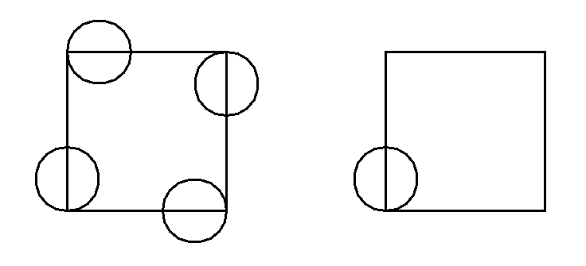

# Schleifen mit Turtles

Die `for`-Schleife wiederholt in Python eine beliebige Anzahl Befehle eine beliebige Anzahl Male:
Wir können das nutzen, um z.B. ein Sechseck einfacher zu zeichnen:

```py live_py title=programm1.py id=7ad50440-9657-40d3-a308-9d7952ecc211
from turtle import *

for i in range(6):
    forward(100)
    left(60)
```

Oder ein Mandala gefällig?

```py live_py title=mandala1.py id=ca54ff96-6cac-4393-a141-8e934de68417
from turtle import *

for i in range(6):
    circle(100)
    left(60)
```

Die Befehle, welche *eingerückt* (nach rechts verschoben) sind, werden von der 
Schleife eine bestimmte Anzahl mal wiederholt.

Hinweis: Drücke, um die Zeilen einzurücken, am Anfang der Zeile die [[Tab]]-Taste,
statt Leerzeichen zu machen. Die [[Tab]]-Taste ist die Taste mit den 2 Pfeilen links
neben dem [[Q]] auf deiner Tastatur.


:::aufgabe[Aufgabe 1: 2 Programme]
<Answer type="state" id="a6d57d11-9ce3-416d-b0cc-150b48d30616" />

Schau dir folgende beiden Programme an, (ohne sie auszuprobieren):

```py title=programm1.py
from turtle import *
for i in range(4):
    forward(200)
    left(90)
circle(40)
```

und

```py title=programm2.py
from turtle import *
for i in range(4):
    forward(200)
    left(90)
    circle(40)
```

Die beiden Programm erzeugen folgende Ausgaben:



Überlege dir:

   1. Welches Programm erzeugt welche Grafik?
   2. Erkläre, weshalb der kleine Unterschied in den beiden Programmen eine so grosse Auswirkung hat.

<Solution id="00fe34b8-ff14-4db3-bb84-56609489e462">

   1. Programm 2 zeichnet die linke, Programm 1 die rechte Grafik.
   2. Damit Python weiss, welche Befehle von der for-Schleife wiederholt werden sollen, muss man sie nach
      rechts einrücken. Alles ,was eingerückt ist, gehört zur Schleife und wird wiederholt. Ohne Einrückung
      gehört der circle-Befehl am Schluss in Programm 1 nicht mehr zur Schleife dazu und wird deshalb auch
      nicht wiederholt.
</Solution>
:::

## Schleifendurchgänge zählen

Vielleicht ist dir in den Beispielen das `i` zwischen dem `for` und dem `in` aufgefallen. Wozu ist es gut?

Betrachte dazu folgendes Programm:

```py live_py title=muschel.py id=c310effc-0341-41cd-bb78-dbc830aa6535
from turtle import *
for r in range(40):
    circle(r*5)
```

:::aufgabe[Aufgabe 2: Muschel]
<Answer type="state" id="83f5d7a2-2aaa-4b6f-b85d-ab7d9ef68a7c" />

Überlege dir:
   1. Weshalb werden die Kreise immer grösser?
   2. Im obigen Programm wurde `r` tatt wie bisher `i` verwendent zwischen dem `for` und dem `in`.
      Wofür steht es wohl? Kannst du einen besseren Namen dafür finden und das Programm entsprechend
      anpassen?

```py live_py title=bessere_muschel.py id=dbcdc47a-63e2-499a-8d1d-f0eda7ded69a
from turtle import *
for r in range(40):
    circle(r*5)
```


