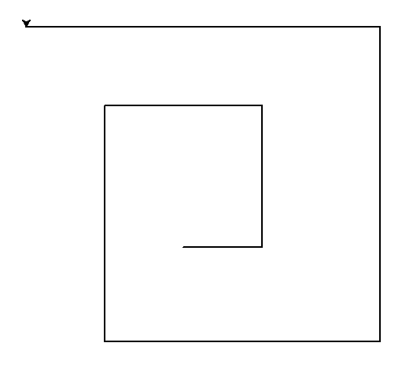
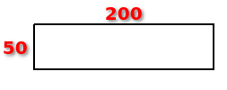
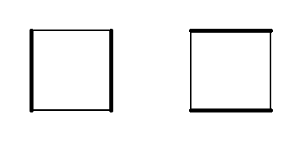

# Schleifen mit Turtles

Die `for`-Schleife wiederholt in Python eine beliebige Anzahl Befehle eine beliebige Anzahl Male:
Wir können das nutzen, um z.B. ein Sechseck einfacher zu zeichnen:

```py live_py title=programm1.py id=7ad50440-9657-40d3-a308-9d7952ecc211
from turtle import *

for i in range(6):
    forward(100)
    left(60)
```

Oder ein Mandala gefällig?

```py live_py title=mandala1.py id=ca54ff96-6cac-4393-a141-8e934de68417
from turtle import *

for i in range(6):
    circle(100)
    left(60)
```

Die Befehle, welche *eingerückt* (nach rechts verschoben) sind, werden von der 
Schleife eine bestimmte Anzahl mal wiederholt.

Hinweis: Drücke, um die Zeilen einzurücken, am Anfang der Zeile die [[Tab]]-Taste,
statt Leerzeichen zu machen. Die [[Tab]]-Taste ist die Taste mit den 2 Pfeilen links
neben dem [[Q]] auf deiner Tastatur.


:::aufgabe[Aufgabe 1: 2 Programme]
<Answer type="state" id="a6d57d11-9ce3-416d-b0cc-150b48d30616" />

Schau dir folgende beiden Programme an, (ohne sie auszuprobieren):

```py title=programm1.py
from turtle import *
for i in range(4):
    forward(200)
    left(90)
circle(40)
```

und

```py title=programm2.py
from turtle import *
for i in range(4):
    forward(200)
    left(90)
    circle(40)
```

Die beiden Programm erzeugen folgende Ausgaben:


Überlege dir:

   1. Welches Programm erzeugt welche Grafik?
   2. Erkläre, weshalb der kleine Unterschied in den beiden Programmen eine so grosse Auswirkung hat.

<Solution id="00fe34b8-ff14-4db3-bb84-56609489e462">

   1. Programm 2 zeichnet die linke, Programm 1 die rechte Grafik.
   2. Damit Python weiss, welche Befehle von der for-Schleife wiederholt werden sollen, muss man sie nach
      rechts einrücken. Alles ,was eingerückt ist, gehört zur Schleife und wird wiederholt. Ohne Einrückung
      gehört der circle-Befehl am Schluss in Programm 1 nicht mehr zur Schleife dazu und wird deshalb auch
      nicht wiederholt.
</Solution>
:::

## Schleifendurchgänge zählen

Vielleicht ist dir in den Beispielen das `i` zwischen dem `for` und dem `in` aufgefallen. Wozu ist es gut?

Betrachte dazu folgendes Programm:

```py live_py title=muschel.py id=c310effc-0341-41cd-bb78-dbc830aa6535
from turtle import *
for r in range(40):
    circle(r*5)
```

:::aufgabe[Aufgabe 2: Muschel]
<Answer type="state" id="77f88411-445c-42f3-85ce-8b9e018e1c43" />

Überlege dir:   
   1. Im obigen Programm wurde `r` statt wie bisher `i` verwendent zwischen dem `for` und dem `in`.
      Wofür steht es wohl? Kannst du einen besseren Namen dafür finden und das Programm entsprechend
      anpassen?
   1. Weshalb werden die Kreise immer grösser?

```py live_py title=bessere_muschel.py id=7c92920d-2193-4c7d-a3a3-9aa8449a1a3d
from turtle import *
for r in range(40):
    circle(r*5)
```

<Solution id="627db1df-7d5d-4417-8bc4-0b818e3f2a48">
   1. Der Name einer Variablen spielt für Python keine Rolle, deshalb können wir ihn frei wählen. `r`
      steht für Radius, also wäre ein passenderer Name `radius`:

```py live_py slim
from turtle import *
for radius in range(40):
    circle(radius*5)
```

   2. Die Kreise werden grösser, weil der Kreis mit einem immer grösseren Radius gezeichnet wird. Das
      passiert, weil das Argument von `circle`, also `r*5`, immer grösser wird. Die Erklärungy
      dafür ist, dass der Wert der Variablen `r` mit jedem Schleifendurchgang zunimmt.
      Tatsächlich erhöht sich der Wert von `r` mit jedem Schleifendurchgang um genau 1. r startet mit
      dem Wert 0 und für den letzten Kreis hat `r` den Wert 39.

</Solution>
:::

Die `for`-Schleife zählt für uns jeden Schleifendurchgang mit, indem sie die Variable, die wir zwischen 
`for` und `in` definieren, in jedem Durchgang automatisch um eins für uns erhöht. Wir nennen diese Variable
deshalb *Schleifenvariable*.

Du kannst sehen, dass Python hinter den Kulissen für uns arbeitet, wenn du folgenes Programm ausprobierst:

```py live_py slim
for zähler in range(5):
    print("In diesem Durchgang ist `zähler`", zähler)
```

Wenn du das Programm ausführst, siehst, du, dass es von 0 auf 4 zählt. Daran, dass Python bei 0 statt bei
1 beginnt, wirst du dich gewöhnen müssen - viele Programmiersprachen beginnen gerne mit 0 zu zählen.

## Für jedes Ding in einer Liste von Dingen...

Hast du dich gefragt, wozu das `range(...)` genau gut ist? Warum muss man das schreiben? Wenn 
Programmierer gerne unnötiges weglassen, warum heisst es dann nicht einfach

```py live_py slim
from turtle import *

for i in 6:
    forward(100)
    left(60)
```

Der Grund: Die eigentliche Aufgabe der Schleifenariable besteht nicht darin, die Schleifendurchgänge zu 
zählen - das sieht nur so aus, weil wir bisher die Schleifenvariable nur so verwendet haben. Sie erledigt
aber einen anderen Job: Die for-Schleife wiederholt etwas für jedes Element in einer vorgegebenen
Liste von Werten, und die Schleifenvariable wird in jedem Durchgang an den jeweils nächsten Wert in 
der Liste gebunden.

Probiere folgenes Programm aus:

```py live_py slim id=195ae336-a0b7-4fb6-858e-eba3b12424d9
from turtle import *
for i in [0, 1, 2, 3, 4, 5]:
    circle(100)
    left(60)
```

Beachte, dass wir das `range(6)` mit der Liste `[0, 1, 2, 3, 4, 5]` ersetzt haben (Listen werden in eckige
Klammern geschrieben). Wenn du das Programm ausführst, merkst du aber, dass es keine Rolle spielt, ob wir
`range` verwenden oder die Liste - das Resultat ist exakt das Gleiche.

Tatsächlich ist `range()` eine Abkürzung, so dass wir nicht eine ganze Liste aufschreiben müssen. Die 
for-Schleife will nämlich eigentlich eine Liste hinter dem `in` haben, und `range(n)` erzeugt einfach
nur eine Liste für uns, welche alle Ganzzahlen von 0 bis n-1 enthält.

:::note[Hinweis - Vereinfachung]
Das stimmt so nicht ganz. `range()` liefert zwar alle Werte, die in der entsprechenden Liste stehen würden,
erzeugt aber tatsächlich etwas anderes. Die Details sind aber hier für das Verständnis eher hinderlich.
:::

Hier sind weitere Beispiele, welche die tatsächliche Funktionsweise der for-Schleife verdeutlichen: Einmal
mit einer Liste von Zahlen:

```py live_py slim id=801041ee-8d63-455c-97b0-b4115d42cc4d
for i in [10, 20, 30, 40, 50]:
    print(i)
```

Und einmal mit einer Liste von Wörtern:

```py live_py slim id=2cfd46fb-17a2-4429-bae1-06a55c0962ed
for word in ['Learn', 'something', 'new', 'every', 'day']:
    print(word)
```

Dabei wird die Schleifenvariable `word` nacheinander an jedes
der Wörer in der Liste gebunden:


:::aufgabe[Aufgabe 3: Listen abarbeiten]
<Answer type="state" id="372ff584-af8f-4fb7-91c6-134492b7718f" />

Probiere folgenes Programm aus:

```py live_py slim title=mandala__mit_liste_1.py id=195ae336-a0b7-4fb6-858e-eba3b12424d9
from turtle import *
for i in [1, 1, 1, 1, 1, 1]:
    circle(100)
    left(60)
```

Erkläre, weshalb auch dieses Programm das Mandala zeichnet, obwohl die Liste diesmal 
nur aus Einsen besteht.

<Solution id="a94b17e1-3a9d-438d-a979-d5c311ce4c93">


</Solution>
:::


:::aufgabe[Aufgabe 4: Eckige Spirale]
<Answer type="state" id="f801556e-4aef-4c64-8bcb-5850832724f7" />

Betrachte die eckige Spirale:



   1. Schau dir das folgende Programm an, welches sie produziert, und überlege dir, welche Seite der Spirale wie lang sind.

```py live_py slim title=mandala__mit_liste_1.py id=deb184f5-b555-47a8-8822-a640ed02f4c7
from turtle import *
for s in [100, 180, 200, 300, 350, 400, 450]:
    forward(s)
    left(90)
```

   2. Passe die Elemente in der Liste im Programm so an, dass es stattdessen das folgende Bild produziert, wenn man es ausführt. Ändere 
   sonst nichts am Programm.




<Solution id="5beeb16d-5854-4e63-9b2f-7ea9e98d2525">


</Solution>
:::


:::aufgabe[Aufgabe 5: Breite der Seiten variieren]
<Answer type="state" id="c5b26b93-7b3d-41d7-8f7d-feff103eba25" />

Schreibe zwei Programme, die jeweils mit einer for-Schleife analog zum Programm in Aufgabe 4
die beiden folgenden Turtlegrafiken repräsentieren. 



Verwende den Befehl `width`, um die Strichdicke zu ändern.


<Solution id="d5238397-ab93-4102-aa98-8c39527677d3">


```py live_py slim title=strichdicke_1.py id=ca198146-4c49-4e78-a1e5-685ca1db87aa
from turtle import *
for dicke in [1, 3, 1, 3]:
    width(dicke)
    forward(100)
    left(90)
```

```py live_py slim title=strichdicke_2.py id=ca198146-4c49-4e78-a1e5-685ca1db87aa
from turtle import *
for dicke in [3, 1, 3, 1]:
    width(dicke)
    forward(100)
    left(90)
```

</Solution>
:::


