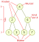
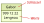
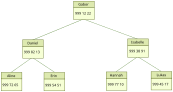

# Bäume

Bäume sind (in der Informatik) Datenstrukturen. Das heisst, sie ordnen bzw. strukturieren 
Daten nach einem bestimmten Prinzip (eben in einer Baumstruktur). Alle Bäume teilen 
einige Fachbegriffe miteinander:

Die Zahlen in den Knoten sind die Schlüssel, die den Baum strukturieren. Das hat den Zweck, dass
ein Schlüssel im Baum schnell gefunden werden kann. Dazu sind die Schlüssel nach bestimmten 
Regeln im Baum angeordnet. In einem _binären Baum_, in dem jeder Knoten höchstens zwei Kinder 
hat, gilt die Regel, dass der linke Kindknoten immer einen kleineren Schlüssel als sein 
Elternknoten hat. Der rechte Kindknoten hat hingegen immer einen grösseren Schlüssel als 
sein Elternknoten. Alle Knoten im Baum müssen diese Regel erfüllen.

Oft sind die Knoten eines Baumes zweigeteilt – einerseits enthalten sie einen Schlüssel,
andererseits einen oder mehrere Werte:

Die Schlüssel geben dem Baum wie gesagt seine Struktur. Wie du siehst, brauchen die Schlüssel nicht
zwingend Zahlen zu sein. Alles, das eine Ordnung hat, d.h. miteinander verglichen und als grösser oder
kleiner eingeordnet werden kann, kann als Schlüssel dienen.

Die Werte sind Daten, welche mit dem Schlüssel verbunden sind. Beispielsweise können wir ein 
Telefonbuch als binären Baum strukturieren. Die Schlüssel sind dann die Namen, die Werte sind 
die Telefonnummern (und vielleicht auch noch zusätzliche Informationen wie Wohnadresse etc):

