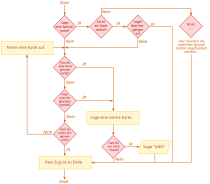
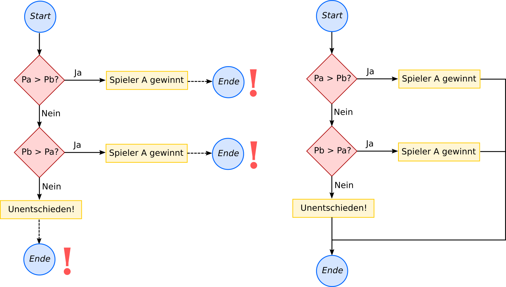
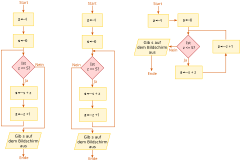

# Flussdiagramme

Flussdiagramme helfen dabei, Abläufe (Prozesse) zu visualisieren. Sie dienten
ursprünglich zur Dokumentation von Abläufen in Unternehmen und sind eine 
verbreitete Methode, komplizierte Abläufe zu beschreiben.

Sie eignen sich auch, um Algorithmen visuell zu beschreiben. Alternativ können
Algorithmen auch als Programme in *Programmiersprachen* beschrieben werden. 
Der Adressat macht den Unterschied: Flussdiagramme sind für Menschen gedacht,
Programme für Computer.

## Formen und Pfeile

Flussdiagramme bestehen aus verschiedenen **Formen**, welche durch Pfeile miteinander
verbunden sind. Die Formen haben eine spezifische Bedeutung und müssen genau
so gezeichnet werden. Wir werden uns auf eine kleine Auswahl von Formen 
beschränken, die für unsere Zwecke ausreicht.

Die Farben, in denen die Formen gezeichnet werden, sind nicht wichtig; sie dienen
nur der Übersichtlichkeit.

Hier ist ein (nicht vollständiges) Flussdiagramm, das dir erklärt, wie du vorgehen
musst, wenn du UNO spielst und am Zug bist:

Wie du siehst, gibt es hier 3 verschiedene Formen:

   1. Die rechteckigen (gelben) Kästen weisen dich an, etwas bestimmtes zu tun
   2. Die (gelben) Parallelogramme werden verwendet, um auf eine Eingabe zu 
      warten oder etwas auszugeben - Das ist im UNO-Beispiel etwas gesucht und
      wir werden auch sonst die Parallelogramme meistens einfach als normale Rechtecke 
      zeichnen. 
   3. Die (roten) Raute-Formen stellen eine Ja-oder-Nein-Frage und werden benutzt,
      um 2 alternative Pfade zu erzeugen, denen du basierend auf deiner Antwort
      folgen kannst.

## Start und Ende

Ein Flussdiagramm hat immer genau *einen* Startpunkt und *einen* Endpunkt:

Die linke Variante des FLussdiagramms ist falsch, weil es mehrere Endpunkte 
gibt. Im rechten Beispiel wurde dies korrigiert, indem die 3 Endpunkte 
zusammengeführt wurden.

## Anordnung der einzelnen Elemente

Die räumliche Anordnung der Elemente in einem Flussdiagramm ist egal. Folgende
drei Flussdiagramme beschreiben exakt denselben Ablauf:

## Strukturierte Flussdiagramme

Das UNO-Beispiel von oben ist recht unübersichtlich, weil bei der Anordnung
der Elemente und der Planung der Verbindung zwischen den Elementen keinerlei
Regeln beachtet wurden.

Es gibt 2 unterschiedliche Probleme:

   1. Ein **Darstellungsproblem**: Die Elemente wurden irgendwo angeordnet, wo sie
      gerade Platz fanden. Das führt zu Unübersichtlichkeit.
   2. Ein **Strukturproblem**: Die Pfeile können von irgendwo im Flussdiagramm zu
      einem beliebigen anderen Element springen. Das macht es schwierig, über
      kleinere Teile des Flussdiagramms isoliert nachzudenken, ohne das ganze
      Diagramm im Kopf behalten zu müssen. Man bezeichnet Programmcode, der 
      analog zu solchen Flussdiagrammen geschrieben wird, als **Spaghetticode**,
      weil der Kontrollfluss ähnlich kompliziert aussieht wie das Problem, das
      andere Ende eines Spaghetti in einem vollen Teller Spaghetti Bolognese
      zu finden!

Strukturierte Flussdiagramme *beschränken* die Wahlmöglichkeiten bei der 
Darstellung und Verbindung von Elementen, um den Gesamtablauf übersichtlicher 
und einfacher nachvollziehbar zu machen.

