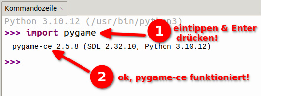
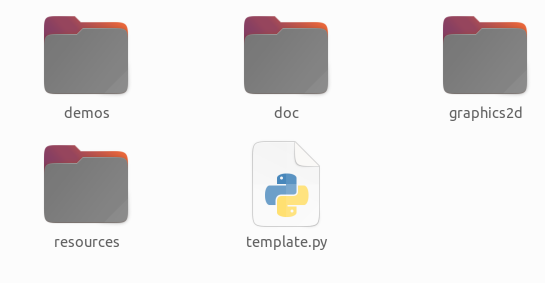

# Installation von graphics2d

## Vorarbeit: pygame-ce

Damit du mit `graphics2d` arbeiten kannst, muss deine Python-Installation über das Paket `pygame-ce`
verfügen. Wenn du nicht weisst, ob dein Python `pygame-ce` installiert hat, kannst du Python öffnen 
und in einer Python-Shell folgendes ausprobieren:

Wenn `pygame-ce` installiert ist, siehst du nach dem eintippen von `import pygame` nach einem 
Moment eine Meldung, die ungefähr so aussieht (die genauen Versionsnummern sind nicht wichtig):

pygame-ce 2.5.8 (SDL 2.32.10, Python 3.10.12)

Wenn du stattdessen einen ModuleNotFoundError erhältst, ist `pygame-ce` nicht installiert. 
Ebenfalls nicht installiert ist es, wenn die Meldung nur mit

pygame

beginnt und nicht mit pygame-ce.

Für Thonny kannst du die kurze [Anleitung zur Installation von pygame-ce](/Anleitungen/Thonny/pygame-installation) konsultieren. 
Hole dir Hilfe, wenn du nicht weisst, wie du `pygame-ce` auf deinem Computer installieren kannst.

## graphics2d installieren

Das graphics2d-Framework kommt als ZIP-Datei. Den Link zum Download findest du am Ende
dieser Seite. Lade die ZIP-Datei herunter und entpacke diese Datei in deinem Informatik-Ordner;
du findest anschliessend den neuen Ordner graphics2d-python. Benenne diesen Ordner nach Belieben
um, z.B. in `mein_grafik_projekt`.

Der Ordner sollte nach dem Entpacken folgenden Inhalt haben:

Vom Python-Script namens `template.py` solltest du eine Kopie erstellen (z.B. `erste_versuche.py`)
und die Kopie im gleichen Ordner belassen. Du kannst dieses Script nun als Startpunkt für dein 
eigenes Grafikprojekt nehmen. Öffne es mit deiner bevorzugten Python-IDE (z.B. Thonny). Wenn du
das Script ausführst, öffnet sich einfach nur ein langweiliges schwarzes Fenster mit einem roten 
Kreis, das du auch wieder schliessen kannst.

:::note[Wichtig]
Achte darauf, dass du alle Programme, die das graphics2d-Framework verwenden, im selben Ordner
ablegst, in dem auch der `graphics2d`-Ordner liegt (Alternativ kannst du auch den gesamten
`graphics2d`-Ordner an den Ort kopieren, an dem du dein Programm aufbewahrst).

Im `graphics2d`-Ordner befindet sich der Programmcode für das Framework. Wenn du das Framework
in deinen eigenen Python-Programmen verwenden willst, ist es am einfachsten, wenn sich dein 
Programm und der `graphics2d`-Ordner am gleichen Ort befinden.
:::

---

## :mdi[Cloud-Download] graphics2d

:mdi[folder-zip-outline]{size=1.5em} [graphics2d-python.zip](resources/graphics2d-python.zip)

