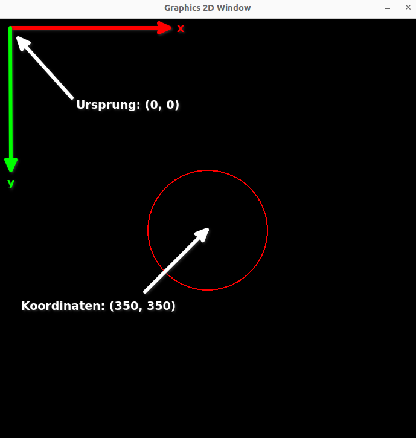

# Erste Grafiken zeichnen

:::aufgabe[Aufgabe 1]
<Answer type="state" id="b4315874-3577-4381-819a-8d3da777e842" />

Wenn du es nicht schon gemacht hast, erstelle nun eine Kopie von `template.py` (im gleichen
Ordner!) und nenne die Kopie `erste_schritte.py`.
:::

## Das einfachste Grafikprogramm

`erste_schritte.py` enthält eine ganze Menge Zeilen, aber das einfachste Programm, das du 
mit `graphics2d` schreiben kannst, ist deutlich kürzer:

:::aufgabe[Aufgabe 2]
<Answer type="state" id="8fc2c2e0-6b7a-4262-913f-484ce42b6ef9" />

Hier ist der im Moment relevante Teil von `erste_schritte.py`:

```py slim title=simple
from graphics2d import *

def on_draw():    
    draw_circle((350, 350), 100, RED, 2)

go()
```   
   1. Finde die Zeile mit draw_circle(...) in `erste_schritte.py`. Sie sieht dort leicht 
      anders aus. Passe sie entsprechend an.
   2. Lösche alle anderen Teile von `erste_schritte.py`, sie sind im Moment nicht wichtig.
   3. Wenn nur noch die Teile von oben übrig sind, führe das Programm aus.
   4. Experimentiere, indem du die Argumente von `draw_circle` änderst - ersetze z.B. die 
      Koordinaten (350, 350) durch zwei andere Werte oder finde heraus, was geschieht, wenn
      du die Zahl 100 durch eine andere Zahl ersetzt.
:::

### import des Frameworks

Die erste Zeile, `from graphics2d import *`, importiert das Grafikframework in dein Script, 
damit du Funktionen wie `go()` und `draw_circle(...)` aufrufen und Konstanten wie `RED` 
benutzen kannst.

### Callbacks

Die zweite Zeile definiert das **Callback** `on_draw`: Ein Callback ist eine Funktion, die
automatisch aufgerufen wird, wenn es einen guten Grund dafür gibt, so dass du dich nicht selbst
um den Aufruf kümmern musst. Genau solche Arbeiten übernimmt ein **Framework** für dich. 

:::note['Magische' callbacks]
`on_draw` ist ein Callback, dessen Name fix definiert ist. Das Framework erwartet genau diesen
Namen. Wenn du `on_draw` umbenennst, z.B. auf `zeichnen`, wirst du feststellen, dass das 
Grafikfenster schwarz bleibt, weil das Framework nicht weiss, dass es zum Zeichnen des Fenster-
Inhalts die Funktion `zeichnen` aufrufen sollte.
:::

Das graphics2d-Framework ruft `on_draw` immer dann auf, wenn es den Inhalt des Grafikfensters
neu zeichnen will. Wenn du nichts anderes einstellst, geschieht dies ungefähr 60 Mal pro 
Sekunde! Du merkst bloss nicht, wie hart das Framework arbeitet, weil der rote Kreis immer 
und immer wieder über sich selbst gezeichnet wird.

### Das Koordinatensystem 

Die Callback-Funktion enthält nur ein einzige Zeile:

```py slim
draw_circle((350, 350), 100, RED, 2)
```

Dies zeichnet einen Kreis mit dem Radius 100 in der Farbe `RED` und benutzt als Mittelpunkt den Punkt mit den Koordinaten
(350, 350). Die Koordinaten (0, 0) befinden sich in der linken oberen Ecke des Grafikfensters und
werden gegen rechts und gegen unten grösser:



### Framework starten

Die letzte Zeile, `go()`, started das Framework. Es sollte immer die letzte Zeile in einem
Grafikprogramm sein, in dem du das graphics2d-Framework verwendest.

Wenn du `go()` weglässt, öffnet sich kein Grafikfenster und es wird nichts gezeichnet, weil
niemand sich darum kümmert, ein Grafikfenster zu erzeugen und das `on_draw`-Callback aufzurufen,
um hinein zu zeichnen.

## Zufällige Farben

Zweifelst du daran, dass `on_draw` mehrmals pro Sekunde denselben Kreis zeichnet? Wir können
das Programm ergänzen, um es zu beweisen.

:::aufgabe[Aufgabe 3]
<Answer type="state" id="f082d64d-cb27-4e4b-9593-9fcda296edeb" />

Ergänze dein Programm wie folgt:

```py slim title=random_colors
from graphics2d import *
from random import choice

def on_draw():
    zufallsfarbe = pick_one_of(RED, GREEN, BLUE, YELLOW, WHITE)
    draw_circle((350, 350), 100, zufallsfarbe, 2)    

go()
```
:::

Wenn du dieses Programm startest, siehst du, dass `on_draw` tatsächlich viele Male
pro Sekunde ausgeführt wird, denn nun ändert die Farbe des Kreises so schnell, 
dass sich die Änderungen kaum mit blossem Auge verfolgen lassen.

Dies demonstriert, wie Bewegung in Filmen und Computerspielen entsteht: Es ist eine
Illusion, die erschaffen wird, indem pro Sekunde Dutzende verschiedene Bilder 
gezeigt werden. Wenn sich diese Bilder voneinander unterscheiden, entsteht für das
Auge der Eindruck von Bewegung. 

Das gleiche Prinzip verwenden Daumenkinos aus Papier, um aus schnell ändernden Bildern
die Illusion von Bewegung zu erzeugen.

