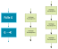
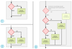
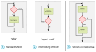

# Grundelemente 

Algorithmen werden aus 3 Bausteinen zusammengesetzt:
   1. Sequenzen
   2. Entscheidungen
   3. Schleifen (Wiederholungen)

Diese 3 Grundelemente können z.B. mit Flussdiagrammen visualisiert werden:

## Sequenzen

Sequenzen kennst du bereits aus den letzten Lektionen. Sequenzen bestehen aus
aufeinander folgenden einzelnen Grundoperationen oder Grundelementen:

Eine Sequenz besteht aus mindestens zwei Elementen, es können aber auch
beliebig (aber nicht unendlich!) viele sein. 

Der Algorithmus zur Lösung des 4-Liter-Rätsels ist eine Sequenz. Er kommt
ohne Entscheidungen oder Schleifen aus.

## Entscheidungen

Entscheidungen sind Verzweigungspunkte in einem Flussdiagramm. Man nimmt 
entweder den einen oder den anderen Pfad, je nachdem, ob man die Frage, die
im diamantförmigen Kasten gestellt wird, mit Ja oder Nein beantwortet. Die
Fragen müssen *immer* Ja-Nein-Fragen sein:

Die drei abgebildeten Muster haben Namen: 

   1. **if**-Anweisung
   2. **if-else**-Anweisung
   3. **if-else if**-Anweisung

## Schleifen

Schleifen wiederholen Teile eines Algorithmus oder Teile eines Flussdiagramms.
Wir haben es mit einer Schleife zu tun, wenn wir an einem Element je nachdem, 
welchen Pfad wir wählen, *mehrmals* vorbeikommen können. Alle Elemente, die wir
mehrmals besuchen können, sind Teil einer Schleife.

Das dritte Muster enthält irgendwo mitten in einer Schleife eine oder mehrere
Entscheidungen, welche aus der Schleife hinaus führen. Der Unterschied zum
ersten und zweiten Schleifenmuster besteht darin, dass beim ersten Muster die
Entscheidung ganz zu Beginn der Schleife steht und beim zweiten Muster ganz am
Ende.

## Kombination der Bausteine

Die hier vorgestellten 7 Bausteine reichen aus, um sämtliche Algorithmen zu 
beschreiben, die es gibt. Sie beinhalten die Muster, die häufig in 
Programmiersprachen zur Kontrolle des Befehlsflusses verwendet werden.

Die Schwierigkeit liegt nicht im Erlernen der
Grundbausteine, sondern darin, diese Bausteine zielführend zu kombinieren.
