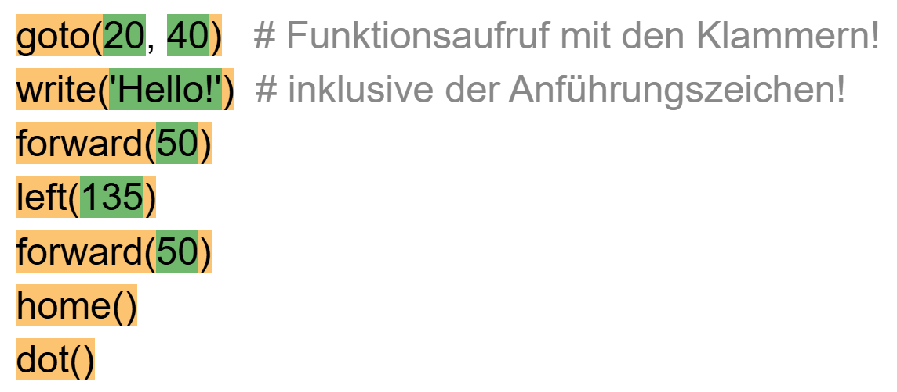
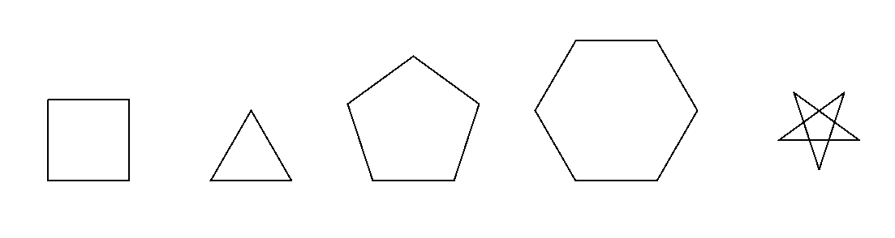

import ProgressState from '@tdev-components/documents/ProgressState';

# Python-Einführung: Turtles 👣

Programmieren heisst, einer Maschine Befehle zu erteilen und sie damit zu steuern. 
Die erste solche Maschine, die du steuerst, ist eine kleine Schildkröte 
(bzw. ein kleines Dreieck) auf dem Bildschirm: Die Turtle :mdi[turtle]{.green}.

Turtlebefehle werden grundsätzlich Englisch geschrieben und enden immer mit einem Klammerpaar.
Darin stehen weitere Angaben zum Befehl. Selbst wenn keine weiteren Angaben nötig sind, muss ein
leeres Klammerpaar vorhanden sein. Die Klein-/Grossschreibung ist wichtig.

Die Turtle kann sich innerhalb ihres Fensters bewegen und dabei eine Spur zeichnen. Um die Turtle
zu bewegen, verwenden wir drei Befehle:
   * `forward(` *distanz* `)`
   * `left(` *winkel* `)`
   * `right(` *winkel* `)`
   
## Das erste Programm

Das erste Python-Programm zeichnet ein Quadrat. Damit die Befehle zum Zeichnen verwendet werden
können, muss zuerst eine Datei mit den entsprechenden Befehlen (ein sogenanntes Modul) `turtle` 
geladen werden.

```py live_py slim title=Quadrat
from turtle import *

left(90)
forward(80)
left(90)
forward(80)
left(90)
forward(80)
left(90)
forward(80)
```

:::note[`from turtle import *`]

Damit Python die Befehle zum zeichnen verwenden kann, müssen diese zuerst aus einer Bibliothek **importiert** werden. Damit beim Importieren nicht jeder einzelne Befehl angegeben werden muss, wird das Zeichen `*` verwendet welches alle verfügbaren Befehle importiert.
:::

:::note[Befehle: `forward`, `left`]

Alle Befehle in Python sind nach demselben Schema aufgebaut:

- einen Befehlsnamen
- runde Klammern
- _optional_ in den runden Klammern eine Auflistung\* von Argumenten, die auch leer sein darf.

```
       forward(90)
       \_____/  \
         /    Argument (Bedeutung hier: 90 Schritte vorwärts)
Befehlsname

       penup()
       \___/ \
         /   keine Argumente nötig
Befehlsname
```

\* werden mehrere Argumente übergeben, dann werden diese mit Kommas abgetrennt, z.B. `goto(20, 30)`

Wird ein Befehl im Programm ausgeführt, spricht man von einem **Befehlsaufruf** - nebst dem Befehlsnamen 
gehören auch die runden Klammern dazu!
:::

:::aufgabe[Aufgabe 1]
<Answer type="state" id="c4c91295-d990-4e1b-8c31-d5b85f500058" />
                         
Markiere im untenstehenden Programm folgende Strukturmerkmale eines Algorithmus mit den vorgegebenen
Farben:

Befehlsaufruf
: (Fachjargon: Funktionsaufruf)
: <span className="badge badge--warning">Orange</span>
Argument
: (wenn es mehrere gibt, markiere sie einzeln)
: <span className="badge badge--success">Grün</span>

<Answer 
  type="text"
  id="b98cda2b-1ebe-4221-966e-543a785931e6"
  toolbar={{background: true}}
  style={{background: 'white', color: 'black'}}
  default={`goto(20, 40)
write('Hello!')
forward(50)
left(135)
forward(50)
home()
dot()
` }
/>

<Solution id="145eb9b4-fb55-43e0-8b6b-343837214bbd">

</Solution>
:::

::::aufgabe[Aufgabe 2]
<Answer type="state" id="281fa074-b6f1-48cd-add8-4d339135c8d7" />

Ändere die Argumente im Programm __QUADRAT.PY__ so ab, dass:

- das Quadrat doppelt so gross gezeichnet wird
- das Quadrat um 45° nach links gedreht gezeichnet wird (auf einer Ecke stehend)

```py live_py title=quadrat.py id=d809c741-4316-4d8d-97c1-3c47e0490b82
from turtle import *

left(90)
forward(80)
left(90)
forward(80)
left(90)
forward(80)
left(90)
forward(80)
```

#### ⭐️ Zusatz:

Die Form der Turtle kann mit dem Befehl `shape` verändert werden. Ändere auf Zeile `3` die Turtleform auf eine Schildkröte durch **Aufrufen des Befehls** `shape` mit dem **Argument** `'turtle'`.

:::details[Mögliche Parameter für den Befehl `shape`]
- `'arrow'`
- `'turtle'`
- `'circle'`
- `'square'`
- `'triangle'`
- `'classic'` (standard)
:::

<Solution id="459dcb49-a3db-468f-966c-2456e0efc64c">

```py live_py slim
from turtle import *

shape('turtle')
left(135)
forward(160)
left(90)
forward(160)
left(90)
forward(160)
left(90)
forward(160)
```
</Solution>

::::


### Farben

Die Stiftfarbe kann mit dem Befehl `pencolor('red')` auf rot gewechselt werden. Es gibt eine vordefinierte Farbpalette für die Stiftfarben.

```py live_py title=farben slim
from turtle import *

forward(30)
right(90)

pencolor('red')
forward(30)
right(90)

pencolor('blue')
forward(30)
right(90)

pencolor('green')
forward(30)
```

:::details[Gesamte Farbpalette :mdi[palette]{.cyan}]{.small-table .no-table-header}
|             |                                                                            |
| :---------- | :------------------------------------------------------------------------- |
| `yellow`    | <div style={{width: '8em', height: '1em', background: 'yellow'}}></div>    |
| `gold`      | <div style={{width: '8em', height: '1em', background: 'gold'}}></div>      |
| `orange`    | <div style={{width: '8em', height: '1em', background: 'orange'}}></div>    |
| `red`       | <div style={{width: '8em', height: '1em', background: 'red'}}></div>       |
| `maroon`    | <div style={{width: '8em', height: '1em', background: 'maroon'}}></div>    |
| `violet`    | <div style={{width: '8em', height: '1em', background: 'violet'}}></div>    |
| `magenta`   | <div style={{width: '8em', height: '1em', background: 'magenta'}}></div>   |
| `purple`    | <div style={{width: '8em', height: '1em', background: 'purple'}}></div>    |
| `navy`      | <div style={{width: '8em', height: '1em', background: 'navy'}}></div>      |
| `blue`      | <div style={{width: '8em', height: '1em', background: 'blue'}}></div>      |
| `skyblue`   | <div style={{width: '8em', height: '1em', background: 'skyblue'}}></div>   |
| `cyan`      | <div style={{width: '8em', height: '1em', background: 'cyan'}}></div>      |
| `teal`      | <div style={{width: '8em', height: '1em', background: 'teal'}}></div>      |
| `turquoise` | <div style={{width: '8em', height: '1em', background: 'turquoise'}}></div> |
| `lawngreen` | <div style={{width: '8em', height: '1em', background: 'lawngreen'}}></div> |
| `green`     | <div style={{width: '8em', height: '1em', background: 'green'}}></div>     |
| `darkgreen` | <div style={{width: '8em', height: '1em', background: 'darkgreen'}}></div> |
| `chocolate` | <div style={{width: '8em', height: '1em', background: 'chocolate'}}></div> |
| `brown`     | <div style={{width: '8em', height: '1em', background: 'brown'}}></div>     |
| `black`     | <div style={{width: '8em', height: '1em', background: 'black'}}></div>     |
| `gray`      | <div style={{width: '8em', height: '1em', background: 'gray'}}></div>      |
| `white`     | <div style={{width: '8em', height: '1em', background: 'white'}}></div>     |
:::

:::warning[`'string'`]
Beachte die Anführungszeichen rund um die Farbnamen. Damit Python die Farben als Text 
(eng. `string`) erkennt und nicht plötzlich nach einem gleichnamigen Befehl sucht, werden
direkt vor und hinter dem Text **immer Anführungszeichen** verwendet. Es spielt dabei keine 
Rolle, ob Du einfache `'` oder doppelte `"` Anführungszeichen verwendest.
:::

### Stiftbreite

Die Stiftbreite kann mit dem Befehl `pensize(2)` verändert werden. Voreingestellt ist die 
Stiftbreite `1`.

```py live_py slim
from turtle import *
forward(20)

pensize(5)
forward(20)

pensize(10)
forward(20)

pensize(15)
forward(20)

pensize(20)
forward(20) 
```


:::warning[Zahlen]
Beachte, dass **bei Zahlen keine Anführungszeichen** verwendet werden. *Eine Verwechslungsgefahr mit 
anderen Befehlen besteht nicht, da in Python keine Befehle mit einer Zahl beginnen.*
:::

## Reguläre n-Ecke zeichnen

Du hast bereits das Quadrat gezeichnet. Es gibt neben dem Quadrat noch weitere reguläre n-Ecke und
auch weitere reguläre Formen wie Sterne. Kannst du alle der folgenden Figuren zeichnen? Die Grösse
der Figuren ist egal, aber die Seitenlänge und Winkel müssen in jeder Figur für alle Seiten bzw. 
Ecken gleich sein:



:::aufgabe[Aufgabe 3: Gleichseitiges Dreieck]
<Answer type="state" id="4075cec5-8173-4cd3-bf3d-de4ce3a68825" />

Zeichne ein gleichseitiges Dreieck!

```py live_py title=dreieck.py id=b2bbe067-cefe-497b-af5c-0f1314e7268e
from turtle import *

```
<Solution id="9d93f3ff-cccf-4645-8647-98025bc35666">

```py live_py slim
from turtle import *

forward(100)
left(120)
forward(100)
left(120)
forward(100)
left(120)
```
</Solution>
:::

:::aufgabe[Aufgabe 4: Pentagon]
<Answer type="state" id="ae03265c-ff66-476e-969d-b5416718a6ff" />

Zeichne ein Pentagon (ein gleichseitiges Fünfeck). Die Form, nicht 
das US-amerikanische Gebäude :-D

```py live_py title=pentagon.py id=ad3ddc0e-7176-4003-b120-34bfd3f44560
from turtle import *

```
<Solution id="0727ce44-f06e-4ab8-9201-105107d78298">

```py live_py slim
from turtle import *

forward(100)
left(72)
forward(100)
left(72)
forward(100)
left(72)
forward(100)
left(72)
forward(100)
left(72)
```
</Solution>
:::

:::aufgabe[Aufgabe 5: Hexagon]
<Answer type="state" id="42e1282c-c2d0-4ca4-9b63-ccac09c1f17b" />

Zeichne ein Hexagon (gleichseitiges Sechseck)

```py live_py title=hexagon.py id=d7b6f1ba-01a3-4b09-a7f9-3d32e92520fb
from turtle import *

```
<Solution id="1e60975e-0b63-4b39-96f0-a3605aeb3ec5">

```py live_py slim
from turtle import *

forward(100)
left(60)
forward(100)
left(60)
forward(100)
left(60)
forward(100)
left(60)
forward(100)
left(60)
forward(100)
left(60)
```
</Solution>
:::


:::aufgabe[Zusatzaufgabe: Sterne]
<Answer type="state" id="e6071c20-559b-46d7-ae3d-026686ef3275" />

Zeichne den 5zackigen Stern (auch als Drudenfuss oder Pentagram bekannt).
Wenn du diesen Stern schaffst, überlege dir, wie du einen 6zackigen Stern 
(Davidstern) zeichnen könntest.


```py live_py title=stern.py id=21707dc9-8e9b-4f1e-a287-47112cfb618e
from turtle import *

```
<Solution id="960716d3-0b9a-4c23-945e-c2b7f6ac27b0">

```py live_py slim
from turtle import *

forward(100)
left(144)
forward(100)
left(144)
forward(100)
left(144)
forward(100)
left(144)
forward(100)
left(144)
```
</Solution>
:::

