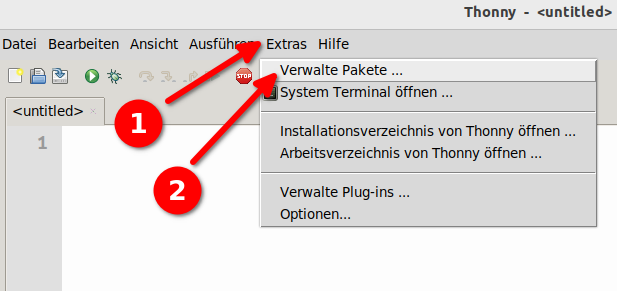
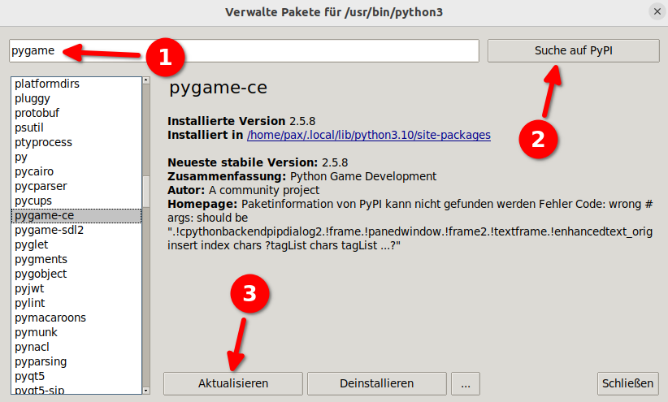

# pygame-ce in Thonny installieren

[pygame-ce](https://pyga.me) ist eine Bibliothek zur Erstellung von Spielen und anderen interaktiven 
grafischen Anwendungen in Python.

**pygame-ce** ist ein *Fork*, d.h. eine Variante von **pygame**. Dieser Fork wird schneller
weiterentwickelt und besser unterhalten als die ursprüngliche Bibliothek pygame.

Um pygame-ce in Thonny zu installieren, gehe folgendermassen vor:

(1) Beachte: Das "Extras"-Menü heisst je nach Version von Thonny auch "Werkzeuge".

Es öffnet sich folgender Dialog:

Tippe im Suchfeld `pygame-ce` ein (1) und drücke den Suchen-Knopf (2). Anschliessend kannst
du unten bei (3) den Installieren-Knopf drücken (oder, wie im Bild, den Aktualisieren-Knopf, 
falls pygame-ce in deinem Thonny bereits installiert ist).

Nun kannst du das Fenster schliessen und in der Shell (Kommandozeile) überprüfen, ob alles
ordnungsgemäss funktioniert:

